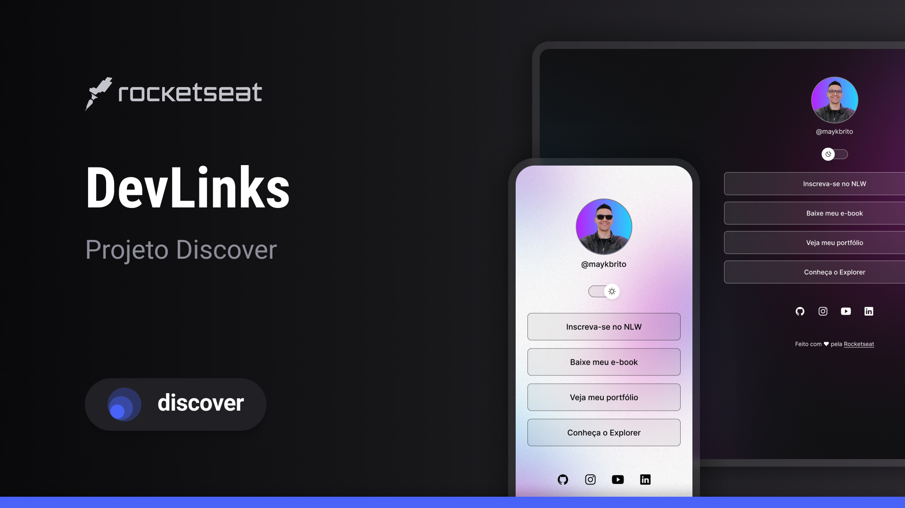

 DevLinks 

 
Programa exclusivo e gratuito, promovido pela Rocketseat para ensino de tecnologias WEB

 <a href="#-tecnologias">Tecnologias</a>&nbsp;&nbsp;&nbsp;|&nbsp;&nbsp;&nbsp;
 <a href="#-projeto">Projeto</a>&nbsp;&nbsp;&nbsp;|&nbsp;&nbsp;&nbsp;
 <a href="#-layout">Layout</a>&nbsp;&nbsp;&nbsp;|&nbsp;&nbsp;&nbsp;
 <a href="#-memo-lincença">Licença</a>
 

 

   

 

   

## Tecnologias

Esse projeto foi desenvolvido com as seguintes tecnologias:

- HTML e CSS
- JavaScript
- Git e GitHub
- Figma

## Projeto

O DevLinks é um agregador de links pra usar como cartao de visitas online.

## Layout

Voçê pode visualizar o layout do projeto através [DESSE LINK](<https://www.figma.com/file/w1LNB9RBisVJ7JMTeZi3QG/DevLinks-%E2%80%A2-Projeto-Discover-(Community)-(Copy)?type=design&node-id=10-620&mode=design&t=ZqFVEfrYfPPpy4oG-0>). É necessário ter conta no [figma](https://figma.com) para acessá-lo

## :memo: Licença

Este projeto está sobre a licença MIT.

---

Feito com S2 by Rocketseat :wave: [Participe da nossa comunidade!](https://www.discord.gg/rocketseat)
